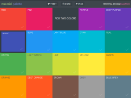
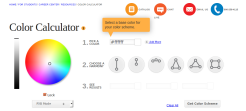
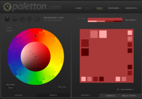
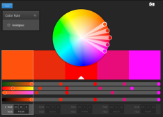
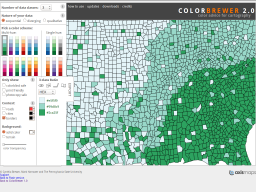
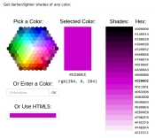

## Color Palette Helpers ##
Date: 2015-10-19

These are all online tools you can use with your webbrowser. Most of these tools help you choose a palette - base on a primary color. They will give you an additional 3-7 colors. They are ~mostly~ mobile-friendly.

*material palette*
https://www.materialpalette.com/
> My top choice. Super easy. Gets to the point.

*Color Wheel - Color Calculator*
http://www.sessions.edu/color-calculator
> This is part of some online school.

*Paletton.com*
http://paletton.com/
> A well done UI, fun to explore

*Adobe Color CC*
https://color.adobe.com/create/color-wheel/
> Another fun tool, the default works best in full screen mode.

*Color Brewer 2.0, color advice for cartography*
http://colorbrewer2.org/
> This tool is so cool, it works well for Mobile design too.

*HTML Color Picker*
http://www.w3schools.com/tags/ref_colorpicker.asp
Picker the primary color in one of three ways.

