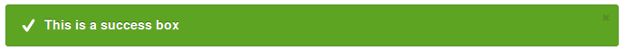
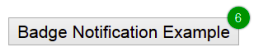

# local-notification-javascript-only #
Date: 2016-02-21  
Last Update: 2016-02-21

All the following "local notifications" include code and demos, if not a visual to demonstrate what is being produced. In addition, if code has an "outdated" notice with it, it was not included.

## Alert() Like ##
- [Building CSS3 Notification Boxes With Fade Animations](http://designshack.net/articles/css/build-css3-notifications-with-fade-animations/)
    - CSS3 notification boxes which appear at the top of the page body. Users may then click on the notifications to have them fade away and eventually remove them from the DOM

## Notification Box Like ##

These are all very similar.

 Article  | Website/Author
----------|----------------
[Notification Box &ndash; Alert Boxes using CSS](http://w3lessons.info/2013/01/11/notification-box-alert-boxes-using-css/)      | w3lessons.info
[CSS Message Boxes for different message types](http://www.jankoatwarpspeed.com/css-message-boxes-for-different-message-types/) | jankoatwarpspeed.com
[CSS Notification Boxes](http://www.cssportal.com/blog/css-notification-boxes/)                                                 | cssportal.com
[Giveaway 10 CSS Notification Boxes For Free](http://www.paulund.co.uk/giveaway-10-css-notification-boxes-for-free)             | paulund.co.uk
[Error, Success, Warning, and Info Messages with CSS](http://isabelcastillo.com/error-info-messages-css)                        | isabelcastillo.com
[Create CSS3 Notification Boxes in Blogger using "Shortcodes" ](http://www.mybloggertricks.com/2015/04/message-box-shortcodes-for-blogger.html) | mybloggertricks.com
[Simple CSS notification boxes without using any icon](http://aviaryan.in/blog/css-notification-bubble-box.html)                | aviaryan.in
[Cool Notification Messages with HTML CSS](http://www.anirbanadak.com/cool-notification-messages-html-css)                      | anirbanadak.com
[Pure CSS Notification Bars](http://webdesignerhut.com/pure-css-notification-bars/)                                             | webdesignerhut.com
[CSS Message Notification Bars](http://timtrott.co.uk/css-message-notification-bars/)                                           | timtrott.co.uk

## Toast Like ##
There are few stand-alone "toast" libraries, likely because they are so easy to make. I'll try to find some tutorials.

 Article  | Comments
----------|----------
[Simple JavaScript Notifications with *toastr*](http://johnpapa.net/toastr100beta/) | toastr is a simple JavaScript toast notification library that is small, easy to use, and extendable.

## Badges/Pinned Notifications ##

Badges are generally "pinned bubbles". They all look very similar.

- [Facebook Style Notification Popup using CSS and Jquery.](http://www.9lessons.info/2014/09/facebook-style-notification-popup-using.html)
- [Menu Notification Badges Using HTML5 Data-Attributes](http://webdesign.tutsplus.com/articles/menu-notification-badges-using-html5-data-attributes--webdesign-6273)
- [css arrow please!](http://www.cssarrowplease.com/) | **This is a cool tool to generate the CSS for your Notificaton**
- [iPhone Notification Badge in CSS](https://web.archive.org/web/20150913050106/http://blog.thinkingstiff.com/2012/01/21/iphone-notification-badge-in-css/) | This is from archive.org. On this date (2016-02-22), the domain had expired.
- [Create a CSS Notification Badge](http://www.cssportal.com/blog/create-css-notification-badge/)
- [Adding a badge style count indicator](http://rimblas.com/blog/2014/05/adding-a-badge-style-count-indicator/)
- [CSS snippets tagged ?Badge? ](http://www.cssflow.com/snippets/tag/badge) - 5 examples
- [iOSBadge - iOS style notification badges for modern browsers](http://kristerkari.github.io/iOSBadge/) - Lots of options, but maybe too complex
- [Hop Over Notification Badge](http://codepen.io/plfstr/pen/cgsGH?editors=1100) - Very cool effect (codepen.io)
- [iOS-Style Notification Badge](http://codepen.io/rnarian/pen/hszeo?editors=1100) - (codepen.io)
- [Menu Notification Badges (PSD)](http://www.premiumpixels.com/freebies/menu-notification-badges-psd/)
- [Notification Badge Css Class](http://www.tuto4free.com/2014/10/badge-class.html)
- [Navigation Menu With Notifications Using CSS](http://www.bloggermint.com/2012/09/navigation-menu-with-notifications-using-css/)

## Growl Like ##

 Article  | Comments
----------|----------
[Pop From Top Notification](https://css-tricks.com/pop-from-top-notification/) by Chris Coyier            | A design pattern where a notification pops down from the top of the browser window, then slides away.
[How to Make a Pure CSS Alert Bar](http://joshnh.com/weblog/how-to-make-an-alert-bar/)                    | -
[Auto Hide Notification Box in Blogger](http://www.stramaxon.com/2013/02/auto-hide-notification-box.html) | -

## JQuery Plugins ##

 Article  | Comments
----------|----------
[Notify.js](https://notifyjs.com/)           | Toast like
[Noty](http://ned.im/noty/#/about)           | create alert - success - error - warning - information - confirmation messages as an alternative the standard alert dialog.
[Lobibox](http://lobianijs.com/site/lobibox) | Free responsive jQuery messagebox and notification plugin available for commercial and non-commercial usages.
[FreeNBar](http://www.jqueryscript.net/other/Create-A-Responsive-Top-Notification-Bar-with-jQuery-CSS3-Freenbar-js.html) | Create A Responsive Top Notification Bar with jQuery and CSS3 - Freenbar.js
    - 

## Web Notifications API/WebKit ##

The *Web Notifications API* is defined as "an API for end-user notifications. A notification allows alerting the user outside the context of a web page of an occurrence, such as the delivery of email."

*NOTE:* As of this writing, permission is required from the end-user to use these notifications.

- Mozilla [Notification](https://developer.mozilla.org/en-US/docs/Web/API/notification)
- [An Introduction to the Web Notifications API](http://www.sitepoint.com/introduction-web-notifications-api/)
- [Web Notifications](http://www.thecssninja.com/html5/web-notifications)
- [Why (and How) you Should Probably Use Web Notifications](http://www.inserthtml.com/2013/10/notification-api/)
- [HTML5 Web Notifications](http://www.girliemac.com/html5-notifications-webOS-style/) [source](https://github.com/girliemac/html5-notifications-webOS-style)

## StackOverflow Answers ##

- [Show an Android style toast notification using HTML/CSS/JavaScript](http://stackoverflow.com/questions/17723164/show-an-android-style-toast-notification-using-html-css-javascript)
- [Easiest css for Facebook style ?red? notifications](http://stackoverflow.com/a/5748155/3255670) - This is a pinned bubble.
    
## Repositories ##
- [notification-js](https://www.npmjs.com/package/notification-js) - A dependency-free, well designed and highly customizable notification library.
- [HTML5-Desktop-Notifications](https://github.com/ttsvetko/HTML5-Desktop-Notifications)
- [pnotify](https://sciactive.com/pnotify/) [source](https://sciactive.github.io/pnotify/)
- [UX-lab](http://taitems.github.io/UX-Lab/index.html)
- [Notification Styles Inspiration](http://tympanus.net/codrops/2014/07/23/notification-styles-inspiration/) [demo](http://tympanus.net/Development/NotificationStyles/other-loadingcircle.html)
- [Popup Notifications & Dialogs](http://www.dcodes.net/2/docs/popup_notifications.html#)
- [css-notification-boxes](https://github.com/paulund/css-notification-boxes) - NO DEMO

## website Categories ##
- [cssscript](http://www.cssscript.com/categories/notification/) - categories: *notification*
- [JQueryRain](http://www.jqueryrain.com/demo/jquery-notification-plugin/) - Best jQuery Notification Plugins & Tutorials with Demo
- [freshdesignweb](https://www.freshdesignweb.com/jquery-css-notification/) - 30+ Free jQuery CSS Notification Plugins & Tutorials

## Backend Services ##
- [Pusher](https://pusher.com/tutorials/realtime-notifications) - How To Create Realtime Notifications For HTML5 Apps
- [Pubnub](https://www.pubnub.com/blog/2014-10-28-how-to-broadcast-desktop-chrome-push-notifications-in-the-browser/) - How to Broadcast Desktop Chrome Push Notifications in the Browser

----

Google searches made:
- [notifications only html css javascript](https://www.google.com/search?q=notifications+only+html+css+javascript)
- [html css notification box](https://www.google.com/search?q=html+css+notification+box)
- [html css notification badge](https://www.google.com/search?q=html+css+notification+badge)
- not yet [css notification popup](https://www.google.com/search?q=css+notification+popup)
- not yet [css notification bubble](https://www.google.com/search?q=css+notification+bubble)
- not yet [notification popup jquery](https://www.google.com/search?q=notification+popup+jquery)
- **Growl like**
- not yet [css notification bar](https://www.google.com/search?q=css+notification+bar)
- not yet [css growl notifications](https://www.google.com/search?q=css+growl+notifications)
- not yet [growl notifications javascript](https://www.google.com/search?q=growl+notifications+javascript)
- not yet [jquery growl notifications](https://www.google.com/search?q=jquery+growl+notifications)
- **Alert like**
- not yet [alert html css javascript](https://www.google.com/search?q=notifications+only+html+css+javascript)